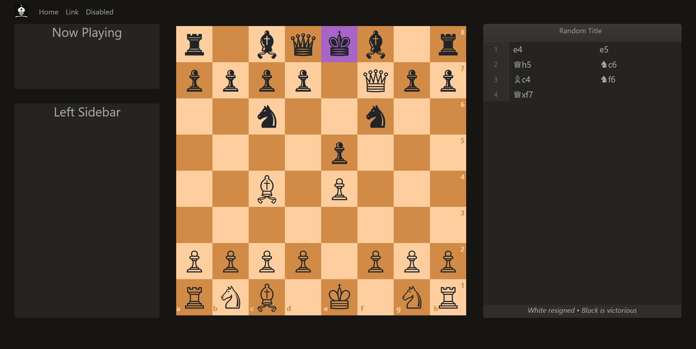

<h2 align="center">React - Chess</h2>




## About <a name = "about"></a>

A lightwieght chess app written from scratch in react

## Getting Started <a name = "getting_started"></a>

These instructions will get you a copy of the project up and running on your local machine for development and testing purposes.

### Features

+ Lightwieght
+ No external dependencies. All functionality is written purely in React.

### Prerequisites

Things you'll to install this project..

+ A working shell ( Bash, Powershell, zsh etc.)
+ The latest version of Git
+ npm
+ yarn

if you don't already have yarn

```sh
npm install --global yarn
```

### Installing

First, clone this project to your local system. You could download as a zip file or clone it throught the terminal

Copy and paste on the terminal

```sh
git clone https://github.com/foderking/react-chess.git

cd react-chess
```

Then install dependencies:

```sh
yarn
```

To run in hot module reloading mode:

```sh
yarn start
```

To create a production build:

```sh
yarn build
```

To run tests:

```sh
yarn test
```

## TODO

- Fix UI
- Add multiplayer support
- Integrate with chess engine


## Credits

+ [yarn](https://classic.yarnpkg.com/en/)
+ [parcel](https://parceljs.org/)
+ [html-boilerplate](https://html5boilerplate.com)
